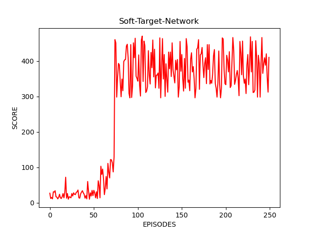

# ОТЧЕТ ПО ДИСЦИПЛИНЕ : ОБУЧЕНИЕ С ПОДКРЕПЛЕНИЕМ И НЕЙРОННЫЕ СЕТИ""

## ПОСТАНОВКА ЗАДАЧИ
**CartPole-v1** - одна из фундаментальных задач в области обучения с подкреплением. Это модель среды, в которой можно управлять тележкой, по центру которой посредством шарнира прикреплен шест или, как указано в множестве источников, маятник. Тележка может перемещаться по горизонтальному рельсу. При этом сила трения **Fтр.** и сила сопротивления **Fсопр.** отсутствуют. 

Задача заключается в следующем: необходимо предотвратить падение маятника. Это достигается за счёт изменения скорости тележки. Скорость же в свою очередь меняется в результате приложения к тележке горизонтальной силы, равной +1 или -1.

В настоящее время проблема **CartPole-v1**  широко распространена и используется в академических целях, а также в целях тестирования различных способов обучения с подкреплением.


## ТЕХНИЧЕСКИЕ ДАННЫЕ

### Переменные состояния (States):
В среде используются следующие переменные состояния:

*Позиция тележки (**Position**)* - значение в диапазоне [-4.8, 4.8]

*Скорость(**Velocity**)* - скорость тележки

*Угол(**Angle**)* - отклонение маятника от вертикали – значение в диапазоне [-24°, 24°]

*Угловая скорость(**Angular velocity**)* - скорость изменения угла наклона маятника


### Действия (Actions):
В среде используются следующие действия:

*Движение влево (**left**)* - приложить к тележке горизонтальную силу, равную +1

*Движение вправо (**right**)* - приложить к тележке горизонтальную силу, равную -1

### Награда (Reward):

В среде предусмотрена награда для каждого очередного шага:

_**Reward**_  = 1

**Примечание:** В данной работе функция награды специально изменена, т. к. основная цель этой работы -- сравнить скорость обучения различных методов. Если агент (среда выполнения) не справился с поставленной задачей, то общая награда уменьшается на 100.

### Начальное условие (Initial condition):
_**Начальное состояние**_ задается при помощи датчика равномерно распределенных случайных чисел.


## СПОСОБЫ РЕШЕНИЯ
Вообще говоря существует достаточное количество различных способов обучения агента (системы). В прошлой работе был детально описан метод **DQN**, в этой же работе анализ получившихся данных производится на основе модернизации данного алгоритма, а именно **Double-DQN** (далее просто **DDQN**) и **Soft-Target-Network** (далее **STN**).

Грубо говоря, оба метода имеют сравнительно схожую реализацию. Ведь по сути, и тот, и другой подходы направлены на стабилизацию работы алгоритма **DQN**. Это необходимо в силу выявленной неустойчивости подхода **DQN** при решении задачи **MountainCar-v0**.

Рассмотрим каждый метод более детально.

**Примечание:** Кодовая реализация подходов отличается одной строкой - проверкой условия. Посмотреть на код можно здесь: 

[Код](DDQN_STN.py)

## DDQN
Сам метод, как и было сказано выше, основан на **DQN**:

При **DDQN** агент использует две нейронные сети, чтобы узнать и предсказать, какие действия следует предпринять на каждом шаге.  Одна сеть, называемая сетью Q или **сетевой сетью** (**target network**/ **online network**), используется для прогнозирования того, что делать, когда агент оказывается в  новом состоянии.  Она принимает состояние в качестве входных и выходных значений  для возможных действий, которые могут быть предприняты.

Чтобы понять принцип работы, можно посмотреть на следующий пример:


Агент (система) сначала находится в состоянии ***S***. Затем, основываясь на некоторых предыдущих расчетах, агент понимает куда ему "выгоднее" идти в ***Q(s, a1)*** или в ***Q(s, a2)***. Он принимает решение идти в состояние ***S'***

Собственно поэтому в названии метода и содержится слово **DOUBLE**.

## Soft Target Network (with DQN)
**Soft Target Network** - специальный подход в обучении с подкреплением, который заключается в том, чтобы выровнять состояния весов в двух сетях основной и сетевой(**current network** and **target network**). При этом данное обновление происходит итерационно, в отличие от схожего метода **Hard Target Network** , в котором обновление произойдет лишь спустя определённое количество операций, хотя и тот, и этот способы взаимозаменяемы.

Говоря обще:  веса основной сети должны отражать веса сетевой сети после каждого воспроизведения опыта согласно формуле:

    target_weights = target_weights * (1-TAU) + q_weights * TAU  где  0 < ТАУ

Основное отличие заключается в данной функции:
 ``` python
 def update_target_model(self):
        if not self.mode:
            self.target_model.set_weights(self.model.get_weights())
            return

        if self.mode == 'soft':
            q_model_theta = self.model.get_weights()
            target_model_th = self.target_model.get_weights()
            counter = 0
            for q_weight, target_weight in zip(q_model_theta, target_model_th):
                target_weight = target_weight * (1 - TAU) + q_weight * TAU
                target_model_th[counter] = target_weight
                counter += 1
            self.target_model.set_weights(target_model_th)
  ```


## АНАЛИЗ РЕЗУЛЬТАТОВ
Ниже представлены графики и столбчатые диаграммы, которые иллюстрируют оба подхода. Представлены они соответственно **DDQN** и **STN**.





Начальные параметры и там, и там идентичны:

``` python
GAMMA = 0.95
TRAINING_DATA_SIZE = 1000
EPSILON_MIN = 0.01
EPSILON_DECAY = 0.999
EPISODES = 250
LEARNING_RATE = 0.0001
BATCH_SIZE = 32
TAU = 0.1
```

Анализируя полученный результат, можно с уверенностью сказать, что примененные подходы, а по сути модернизация **DQN**, полностью себя "оправдывают". Теперь результат не "падает", а держится стабильно неким шумом в определённой области, конечно же при этом выполняется и сама задача удержания маятника.

Отличие же между **DDQN** и **STN** почти незаметны, единственное, что стоит отметить: шум **STN** немного реже чем шум **DDQN**.


## ВЫВОД
В работе были проанализированы два подхода к обучению агента (среды) **CartPole-v1**. Были выявлены явные отличия от **DQN** и большая стабильность работы. Оба алгоритма были реализованы на Python 3.*, приведены графики и гистограммы результатов. 

Таким образом, можно подытожить: поставленная задача была выполнена в полной мере.

## Приложения
[Код](DDQN_STN.py)
